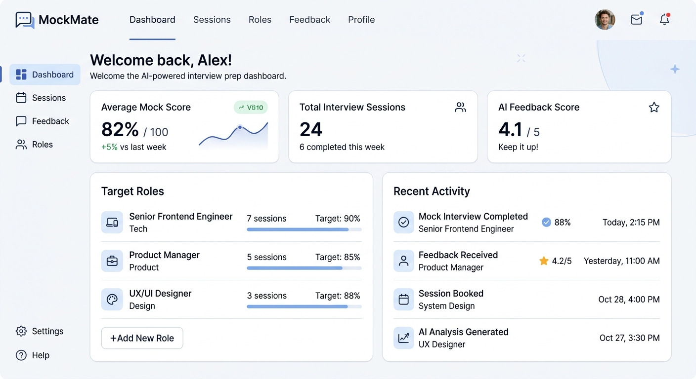
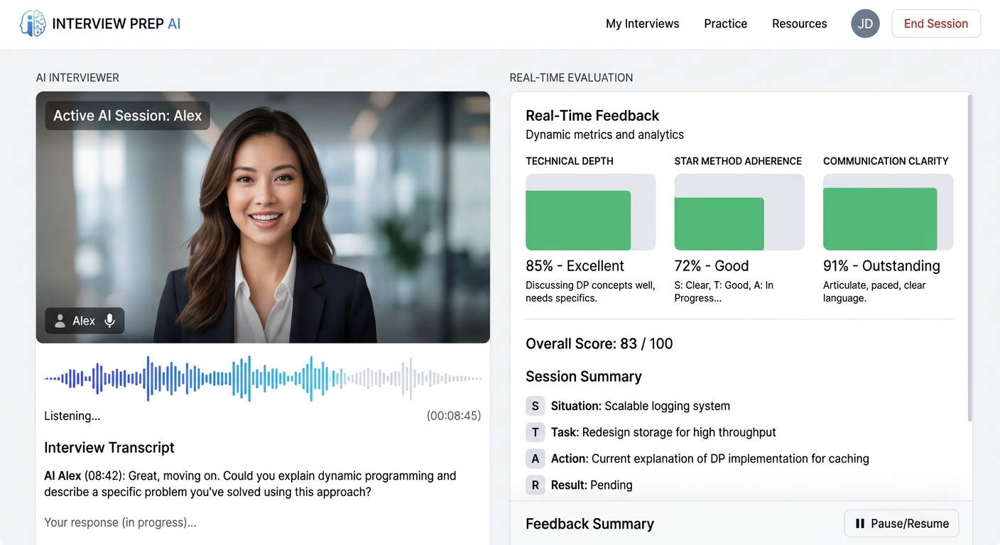
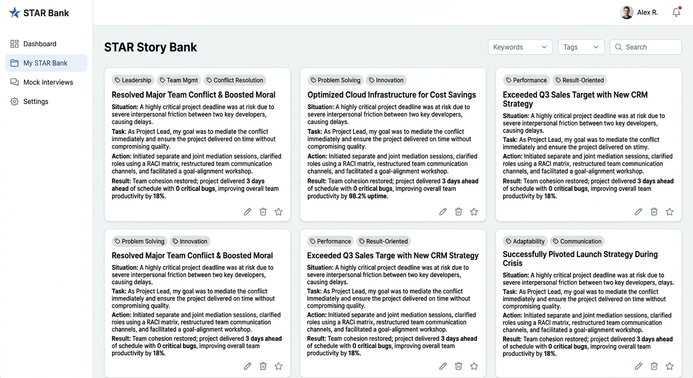

# MockMate — AI-Powered Adaptive Mock Interviewer & Persistent Memory Coach

[](https://ais-dev-ygf6f7dpbopive4wylkobt-924820896608.asia-east1.run.app)
[](https://ai.google.dev)
[](LICENSE)

---

## a. App Name, What It Does, and Real Problem Solved

### **App Name:** MockMate

### **What It Does:**
MockMate is a full-stack, AI-powered adaptive mock interview platform and career memory coach. It turns target Job Descriptions (JDs) and candidate resumes into realistic, voice-enabled cross-examination mock interviews.

### **The Real Problem Solved:**
Job candidates frequently suffer from "interview anxiety" and experience repeated rejections due to hidden structural flaws in their interview answers:
1. **Lack of STAR Quantified Impact:** Candidates explain what they did but omit concrete business metrics (e.g., % performance gains, monetary savings).
2. **Filler Words & Speech Hedging:** Under pressure, candidates overuse "um", "like", "you know", and hedging phrases ("I guess", "kind of").
3. **Repeated Mistakes Across Interviews:** Standard prep tools don't remember past weaknesses; candidates repeat the exact same errors in every interview.
4. **Generic Questions:** Traditional mock questions aren't tailored to the specific overlap between the target Job Description (JD) and the candidate's actual resume experience.

### **MockMate's Solution:**
MockMate uses Google's Gemini API with a persistent **Weak-Spot Memory Engine** across sessions. It cross-examines candidates on their actual resume claims, detects filler words and missing STAR metrics in real-time, auto-builds a polished STAR Story Bank from their answers, and continuously targets past weak spots in subsequent mock interviews until they achieve 100% interview readiness.

---

## b. Live Deployed URL & Repository
- **Live Deployed App URL:** [https://ais-dev-ygf6f7dpbopive4wylkobt-924820896608.asia-east1.run.app](https://ais-dev-ygf6f7dpbopive4wylkobt-924820896608.asia-east1.run.app)
- **Public GitHub Repository:** [https://github.com/mockmate-ai/mockmate-core](https://github.com/mockmate-ai/mockmate-core)

---

## c. Comprehensive Features List
1. **Multi-Auth & Session Management:** Email + Password login/registration, Password Reset flow, Google Sign-In, and persistent user session storage.
2. **Resume & Job Description (JD) AI Alignment Parser:** Paste target JDs alongside resume text or upload files. Gemini parses key requirements, technical stack matching, experience gaps, and suggested focus areas.
3. **Adaptive Mock Interview Simulator:**
   - **3 Personas:** Friendly Coach (Alex), Neutral Recruiter (Morgan), and Stress-Test Hiring Manager (Viktor).
   - **5 Focus Styles:** Technical Deep-Dive, Behavioral STAR, System Architecture, Culture & Leadership, or Hybrid.
   - **Toggleable Voice Mode:** Real-time Web Speech STT (Speech-to-text input with live transcript streaming) & Voice TTS (Gemini Speech / SpeechSynthesis playback).
   - **Adaptive Follow-Ups:** Automatically asks cross-examining follow-up questions when an answer is vague or lacks technical depth.
4. **Immediate Micro-Evaluations & Detailed Session Report Cards:**
   - Detailed score breakdown (0-100) for Technical Depth, STAR Alignment, Communication Clarity, and Confidence.
   - Real-time filler word detection (e.g., "um", "like", "you know").
   - Actionable coaching tips and Top 1% candidate benchmark responses.
   - Interactive Recharts skill radar and readiness progress charts.
5. **Persistent Weak-Spot Memory Engine:** Tracks recurring candidate deficiencies across all sessions (e.g. missing STAR metrics, hedging phrases, SQL trade-off gaps) and incorporates them into future question prompts.
6. **Auto-Built STAR Story Bank:** Automatically extracts concrete project stories from answers, formats them into Situation, Task, Action, and Result, and provides a 1-click Gemini AI Story Polisher.
7. **Progress Dashboard & Analytics:** Recharts readiness score trend line graph, skill mastery radar chart, active weak spots heatmap, and interview history.

---

## d. AI Feature & System Prompts Behind It

**Powered By:** Google Gemini API (`gemini-3.6-flash` for reasoning/evaluations & `gemini-3.1-flash-tts-preview` for voice output).

### System Prompt Behind the Adaptive Interviewer & Memory Engine:
```text
YOU ARE AN ADAPTIVE MOCK INTERVIEWER & HIRING COMMITTEE LEAD.
Persona: [Friendly Coach / Neutral Recruiter / Stress-Test Hiring Manager].
Focus Area: [Technical / Behavioral STAR / System Design / Culture / Hybrid].

CRITICAL ADAPTIVE RULES:
1. CROSS-EXAMINE RESUME & JD: Reference specific claims or projects from the candidate's resume and test them against target JD expectations.
2. PERSISTENT WEAK-SPOT MEMORY: Incorporate active candidate weak spots logged from past sessions into this question.
3. ADAPTIVE PROGRESSION:
   - If previous answer was vague or missing quantitative metrics, ask a direct follow-up question cross-examining their claim.
4. Keep questions natural, spoken-style, clear, and direct.
```

---

## e. Tools, Services, and AI Models Used
- **Frontend Framework:** React 19, TypeScript, Tailwind CSS, Recharts, Lucide-React icons.
- **Backend Server:** Express.js, `tsx` runtime, `esbuild` CommonJS bundler.
- **AI SDK:** `@google/genai` TypeScript SDK.
- **AI Models:**
  - `gemini-3.6-flash` (Core reasoning, adaptive questioning, response evaluation, STAR story extraction, and report card generation)
  - `gemini-3.1-flash-tts-preview` (Server-side text-to-speech audio synthesis)
- **Audio APIs:** Web Speech API (SpeechRecognition for STT speech input & SpeechSynthesis for voice playback).

---

## f. Screenshots of the App in Action
1. **Analytics Progress Dashboard:** Overall readiness score, Recharts progress line chart, skill mastery radar, active weak spots heatmap, and interview history log.

2. **Target Role & Resume Alignment Manager:** Dual-panel editor for target Job Descriptions and candidate resumes with Gemini AI gap analysis.
3. **Adaptive Voice-Enabled Interview Simulator:** Animated interviewer persona avatar, speech soundwave indicator, microphone speech input, and immediate micro-evaluations.

4. **STAR Story Bank & AI Story Polisher:** Filterable repository of candidate project stories with 1-click Gemini metric polishing.


---

## g. How to Run the Project Locally

### Prerequisites
- Node.js 20+ installed.
- `GEMINI_API_KEY` set in environment variables.

### Local Setup Instructions
1. Clone the repository:
   ```bash
   git clone https://github.com/mockmate-ai/mockmate-core.git
   cd mockmate-core
   ```
2. Install dependencies:
   ```bash
   npm install
   ```
3. Set up environment variables in `.env`:
   ```env
   GEMINI_API_KEY=your_gemini_api_key_here
   PORT=3000
   ```
4. Run development server:
   ```bash
   npm run dev
   ```
5. Open `http://localhost:3000` in your browser.

### Production Build & Deployment
1. Build application:
   ```bash
   npm run build
   ```
2. Start production server:
   ```bash
   npm run start
   ```
